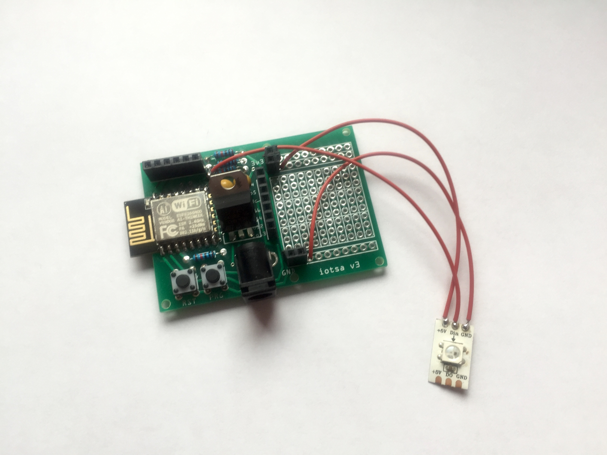
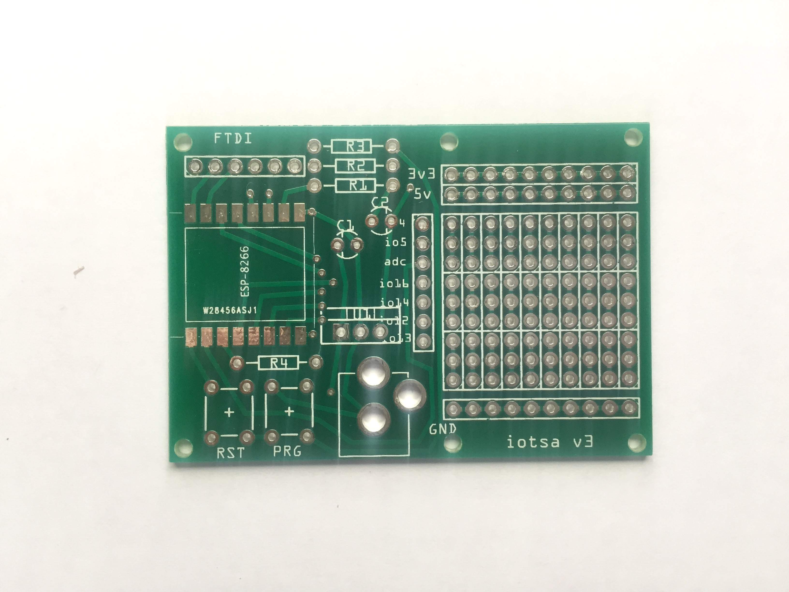
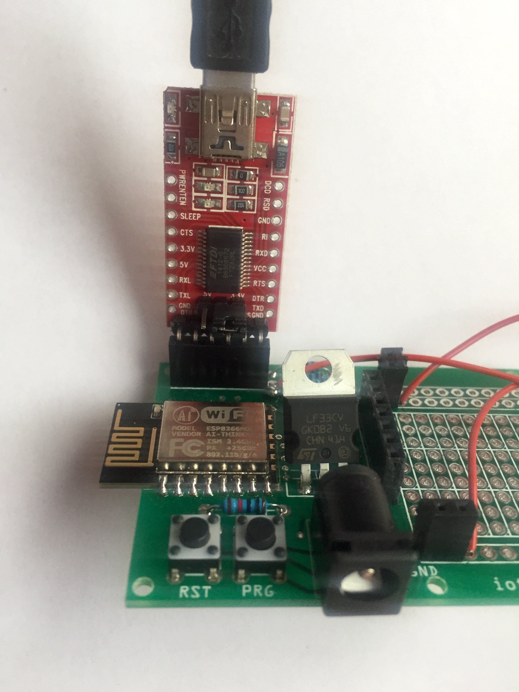

# iotsa board - your tiny IoT web server

Congratulations with your new iotsa WiFi web server,
ready for you to start building strange and wondrous Internet of Things devices!



Maybe your board has the NeoPixel multicolor LED, maybe not. Maybe your board is in a case, maybe not. Maybe your board has the headers, maybe not.

## Getting started

You need a power supply, 5V 350mA, with + on the inside and - on the outside, coaxial 5.5mm x 2.5mm (this is one of the most common 5V power connectors). A larger power supply (up to 18V) is okay if you need that for any other electronics you add (and you may need higher current too, in that case).

The first time you power the iotsa board it will create a WiFi network with a name similar to _config-iotsa1234_. Connect a computer (or smartphone) to that network and visit <http://192.168.4.1>. You will see a web page titled **Iotsa LED Server** (or, possibly, **Iotsa Hello World Server** if you have a iotsa without the NeoPixel).

Go to the [/wificonfig](http://192.168.4.1/wificonfig) page and fill in the name of your Wifi network, the password of your WiFi network and the name you want to use for your iotsa. For the latter use only normal _internet host name_ characters: letters, digits, hyphen, underscore. For example, if you enter _rgbled_ here the device will have the internet address of <http://rgbled.local/>. (Note that if your computer is an older Windows computer you may need to install _mDns_ software to be able to use the _rgbled.local_ address).

After filling in the details press _Submit_ and the device will reboot. It should now connect to your Wifi network and you can browse to it at <http://rgbled.local/>. If you visit the _/led_ page you can make the LED blink or light up in a color you specify in hexadecimal (_ff0000_ for red, _00ff00_ for green, etc). If you have the _Hello World Server_ there is no LED to flash, but you can go to _/hello_ and enter your name, the device will then greet you by name on the homepage).

## Status LED

If your iotsa board has the NeoPixel LED the board will communicate exception status conditions (during normal operation the LED will be off, unless programmed differently). The following patterns have the following meaning:

- _Orange_: the board is trying to connect to the configured WiFi network.
- _Yellow (flashing)_: the board is in configuration mode (at address `192.168.4.1` on its private WiFi network) because it has not been configured yet or because its configured WiFi network is unavailable.* Use the normal _Upload_ command to flash your new program.
* Use the normal _Upload_ command to flash your new program.

- _Magenta (flashing)_: the board is in configuration mode (at address `192.168.4.1` on its private WiFi network) because you asked it to go to configuration mode.
- _Cyan (flashing)_: the board is in OTA-programming mode.
- _Cyan_: the board is in OTA-programming mode and new software is being uploaded.
- _Red_: the board is doing a factory reset.

## Programming
To do fun things with the iotsa board you will need to do some programming, and probably some hardware construction:

* For programming you need the [Arduino IDE](https://arduino.cc), <https://arduino.cc>. You need the version for your computer, not the web version. The Arduino website also has lots of information on getting started with programming Arduino-like devices (such as your iotsa board).
* You also need to install the [ESP8266 support for the Arduino IDE](https://github.com/esp8266/Arduino), <https://github.com/esp8266/Arduino> additions. And again that website has documentation on all the extra features (such as WiFi) that esp8266 devices (such as your iotsa board) give you access to.
* You need to install the [iotsa library](https://github.com/cwi-dis/iotsa), <https://github.com/cwi-dis/iotsa>.
* You may want to install some additional libraries and/or disable them:
	* Check `iotsa/iotsaNtp.h` to enable or disable timezone support using `WITH_TIMEZONE_LIBRARY`. If enabled, you need to install <https://github.com/JChristensen/Timezone> and <http://playground.arduino.cc/code/time>.

> It is also possible to use _PlatformIO_ in stead of the _Arduino IDE_ to program your iotsa board. View the [readme file](../readme.md) for details.

After you have installed all this, in the Arduino IDE you use the menu to select your board: _Tools_ -> _Board_ -> _ESP8266 Modules_ ->  _ESP-12E_, which corresponds to the hardware on your iotsa.

Now you can select a iotsa example program, for example _File_ -> _Examples_ -> _Examples from custom libraries_ -> _iotsa_ -> _Led_. Make some minimal changes if you want (for example changing the title from _Iotsa LED Server_ to _My First RGB Server_). Check that the program compiles with _Sketch_ -> _Verify/Compile_.

To download your new program to the device:

* Use a web browser to visit _/wificonfig_ on your device.
* On the **WiFi configuration** page, select the _Enable over-the-air update after next reboot_ option and press _Submit_.
* Now you need to either press the _Reset_ button on the iotsa, or remove power, wait a few seconds and reconnect power. You should do this within 2 minutes (if you are too late you simply start at the top of this list again).
* In the Arduino IDE, with menu _Tools_ -> _Port_ -> _Network Port_ select your device.
	* Sometimes ota-programmable devices are slow to appear because of mDNS issues. On a Mac, run the following command in a _Terminal_ window to speed up discovery:
	
	```
	dns-sd -B _services._dns-sd._udp.
	```
	or, on Linux,
	
	```
	avahi-browse _services._dns-sd._udp
	```
* Use the normal _Upload_ command to flash your new program.

The iotsa should now reboot and run your code. If your code is based on the iotsa software it will include the over-the-air programming functionality and you can reprogram the iotsa whenever you want (and see the _Troubleshooting_ section below in case of problems).

## Hardware

iotsa board have an experimentation area (10 vertical rows with each row consisting of 3 sets of 3 interconnected holes), horizontal rows with power, 3.3V and 5V (or actually whatever your power supply provides) at the top and a horizontal row of GROUND holes at the bottom. There is also a vertical row with all easily usable _esp8266_ GPIO pins, from top to bottom:

* io4
* io5
* adc (this is the analog input, not a GPIO pin)
* io16
* io14
* io12
* io13



But before you construct hardware on the iotsa board it may be better to try your design out by using a solderless breadboard and using jumper wires to connect your components to your iotsa. For this it is easiest if your iotsa board has headers, so you may want to solder these on.

## Troubleshooting

It is always possible (actually rather common) that you brick your board, to fix this you need to reprogram over USB. Or you may want to see the debug output from `Serial.print()` in your program. For this you need a USB-to-Serial converter. Any such converter will work, but easiest is to use the FTDI232 6-pin converter shown below, because it matches the iotsa pinout:



If you have another converter it must be 3.3V compatible. Make the following connections (counting the FTDI connector slot on the iotsa, from the left)

1. no connection
2. RX (data from iotsa to computer)
3. TX (data from computer to iotsa)
4. no connection
5. no connection
6. Ground

Now proceed with the following steps to reprogram:

* Connect your FTDI to USB and to the iotsa board
* In the Arduino IDE select the correct serial with _Tools_ -> _Port_. On the Mac this will be something like _/dev/cu.usbserial12345_.
* Select baud rate _115200_.
* Press and hold the _PRG_ button on the iotsa board.
* Press and release the _RST_ button on the iotsa board.
* Release the _PRG_ button.
* Use the Arduino IDE _Upload_ command to reprogram the iotsa.

You can use the Arduino IDE serial console to see the debug output of your program, and the iotsa framework itself will also print debug output during initialization and such.
